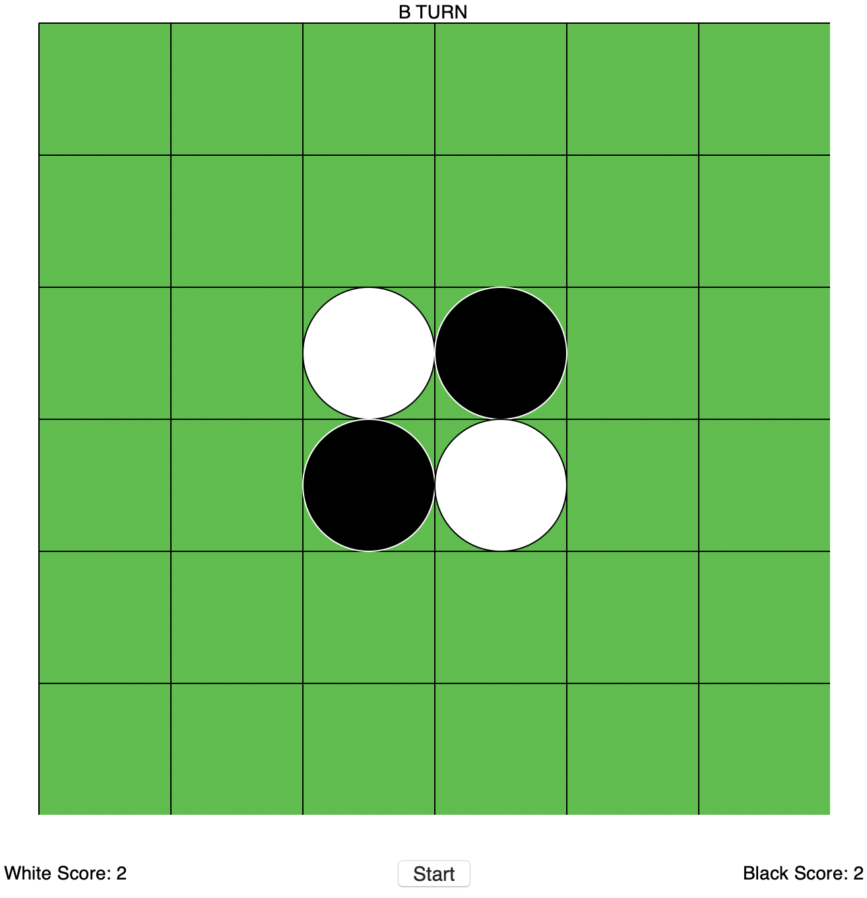

# OthelloGUI
A GUI version of the game Othello. This implementation is meant to be played by two people against each other on a single computer.
The game is implemented in python and uses python's built in GUI library known as tkinter. 

To run the program, execute the following steps:
python3 Run_Othello_GUI.py 

Once start is clicked, the user will be prompted with setting the parameters of the game. 
Choosing dimensions of the game board, players, orientation of players, and setting the winning condition.
\> will set the winning condition to be the player with the most tiles while < will set the condition to be the player with the least tiles.

Once the parameters are set, the game can begin. This is what the start of the game looks like.
Each player will then take turns clicking on the spaces they want to place their tiles on while the game automatically flips the correct tiles to their color.

Once a player wins, the end dialogue will show up as follows.

